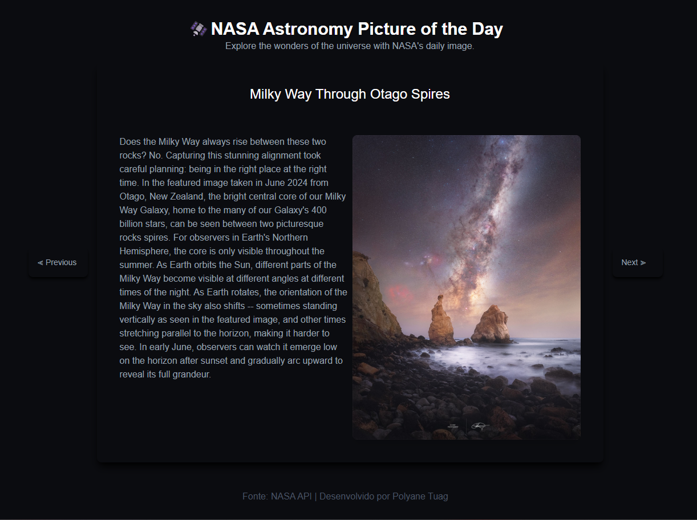

<div align="center" justify-content="space-between">
   
  <h1>NASA Astronomy - Picture of the day 
 </h1>
</div>

<h3 align="center">  
  <p align="center">
    <a href="#-about">About</a>&nbsp;&nbsp;&nbsp;|&nbsp;&nbsp;&nbsp;
    <a href="#-technologies-used">Technologies</a>&nbsp;&nbsp;&nbsp;|&nbsp;&nbsp;&nbsp;
    <a href="#-how-to-run">How to Run</a>&nbsp;&nbsp;&nbsp;|&nbsp;&nbsp;&nbsp;
    <a href="#-license">License</a>
  </p>
</h3>

<div align="center">
     
</div>

## 📚 About

The project in question is a page that shows daily images of the universe, using the *NASA's API*.


## 🚀 Technologies used

- [ReactJs](https://pt-br.legacy.reactjs.org/)
- [Tailwindcss](https://tailwindcss.com/)
- [Typescript](https://www.typescriptlang.org/)


## ⏱️ How to Run

```bash
# Clone the repository
$ git clone https://github.com/polyanetuag/universe_.git

# Enter the folder 
$ cd universe

# Install dependencies
$ yarn

# Start the project
$ yarn dev
```

## 📝 License

This project is under the [MIT license](https://opensource.org/license/mit)

---
Developed with 💜 by Polyane Tuag
